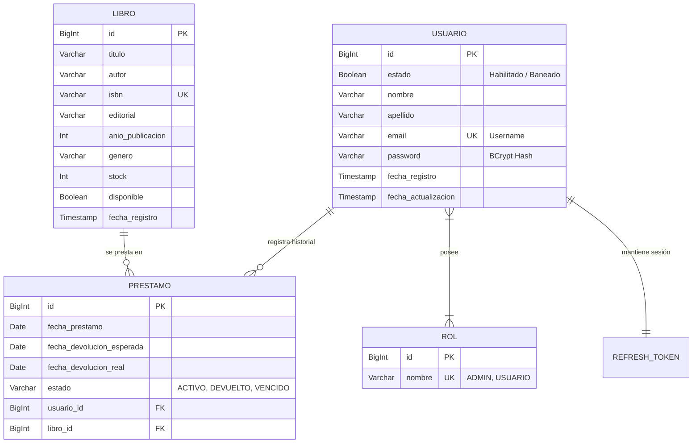

# INFORME TÉCNICO: Sistema de Gestión de Biblioteca Universitaria (API REST)

## 1. Descripción del Sistema

El sistema es una **API RESTful de alto rendimiento** diseñada para la gestión integral de una biblioteca universitaria. Ha sido desarrollada utilizando **Java 21** con el ecosistema de **Spring Boot 3.5.7**, garantizando una arquitectura escalable, segura y eficiente.

### Características Principales:
*   **Seguridad Robusta**: Implementación de **JWT (JSON Web Token)** con sistema de doble token (Access y Refresh) y encriptación de contraseñas mediante **BCrypt**.
*   **Control de Acceso (RBAC)**: Manejo de roles diferenciados:
    *   **ADMIN**: Control total sobre el catálogo de libros, gestión de usuarios (activar/banear) y registro de préstamos.
    *   **USUARIO (Alumno)**: Acceso a consulta de perfil personal e historial de préstamos propios.
*   **Arquitectura Limpia**: Organización por capas (Controladores, Servicios, Repositorios y DTOs) para facilitar el mantenimiento y la extensión del código.
*   **Persistencia Avanzada**: Uso de **Spring Data JPA** sobre una base de datos **PostgreSQL**, con validación automática de integridad y trazabilidad de registros.

---

## 2. Diagrama de Entidades (ER)

El modelo de datos se basa en una estructura relacional normalizada que garantiza que un libro no pueda ser eliminado si tiene préstamos activos y que los tokens de sesión estén estrictamente ligados a un usuario único.

---

## 3. Evidencias de Pruebas (Postman)

A continuación se detallan los resultados obtenidos en las pruebas de regresión realizadas sobre la API, organizadas por flujos críticos:

### 3.1. Flujo de Autenticación y Registro
*   **Registro de Nuevo Alumno**: Prueba del endpoint `/api/auth/register`. Crea una cuenta, encripta la contraseña y asigna automáticamente el rol `USUARIO`.

*   **Inicio de Sesión (Login)**: Generación de **Access Token** y **Refresh Token**. Se verifica la respuesta estructurada con los datos del usuario.

*   **Rotación de Tokens (Refresh)**: Evidencia de cómo el sistema permite obtener un nuevo Access Token sin volver a pedir credenciales, invalidando el Refresh Token anterior por seguridad.

*   **Cierre de Sesión (Logout)**: Inactivación de los tokens en el servidor, garantizando que nadie pueda reusar la sesión.

### 3.2. Gestión del Catálogo (ADMIN)
*   **Registro de Libro**: Creación de material bibliográfico con validación de campos obligatorios.

### 3.3. Gestión de Préstamos y Perfil
*   **Solicitud de Préstamo**: Un administrador registra un préstamo para un alumno. El sistema calcula automáticamente la fecha de devolución (7 días por defecto).

*   **Mi Perfil e Historial**: El alumno consulta su perfil y visualiza en tiempo real la lista de libros que tiene en su poder o que ya devolvió.

### 3.4. Control de Estados (Baneos)
*   **Cambio de Estado**: Evidencia de un Administrador cambiando el estado de un usuario a `"estado": false` (Baneado/Dado de baja).

*   **Bloqueo de Acceso**: Intento de Login de un usuario baneado, verificando que el sistema deniega el acceso con un mensaje administrativo claro.

>  Para recrear estas pruebas, puede importar el archivo incluído `biblioteca.json` en su cliente Postman.

---

## 4. Repositorio en GitHub

El código fuente completo, incluyendo la configuración de Maven, los scripts de base de datos y la colección de Postman, se encuentra alojado de forma pública para su revisión:

*   **Enlace del Repositorio:** [https://github.com/IDat-Nestor/lib-backend-java](https://github.com/IDat-Nestor/lib-backend-java) 🚀
    

